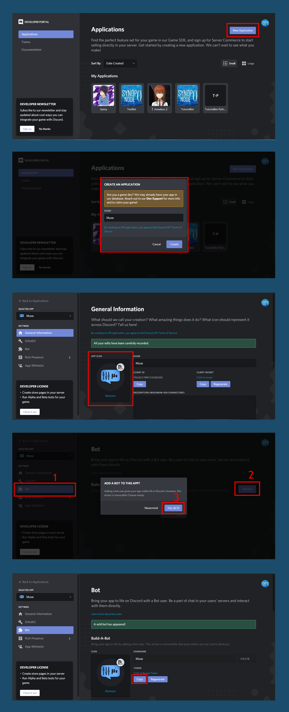
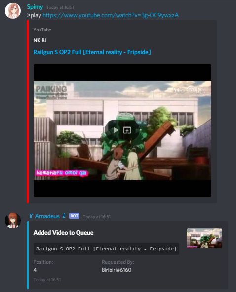
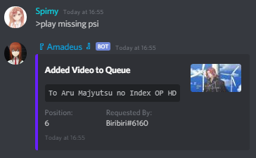
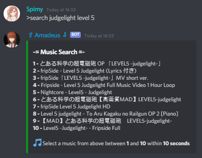
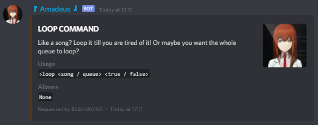
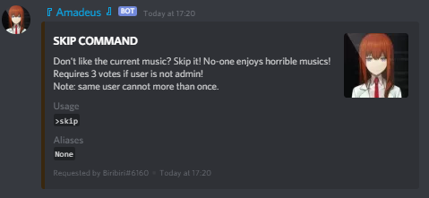
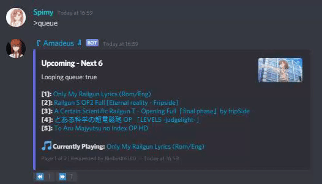
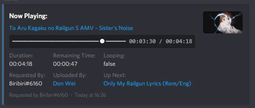
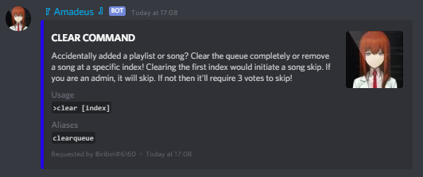
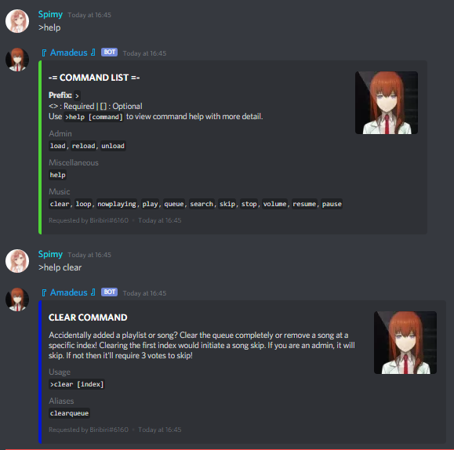

# Muse (μ's)

\
[](https://discord.gg/865tNC4)\
A discord.js bot template already containing music functions\
You can add to this bot by writing your own commands code and putting in the commands folder

**NOTICE:** If the bot crashes or song randomly gets skipped with errors similar to `Error: Too many redirects` then
the error comes from YTDL and I am not responsible for any issues related to said library. If any issues of the like
persists, open an issue on their [GitHub page](https://github.com/amishshah/ytdl-core-discord/issues/).

## Requirements

- NodeJS
- FFmpeg

### NodeJS

You are required to have NodeJS installed.\
If you do not have NodeJS installed, download it at <https://nodejs.org/> and run the installer.
Once installed, open your command line and run `node -v` to check if it has been properly installed.\
You must be running at least V12 of NodeJS!

### FFmpeg

You are required to have FFmpeg installed on your machine to play music.\
If you do not have FFmpeg installed, download it at <https://www.ffmpeg.org/>.

Extract the downloaded files into your C: drive and set up your `PATH` environment variable to the
`bin` folder. Once you have done this, close and reopen your command line if you already have it
opened and run `ffmpeg -version` to check if it has been properly installed.

Watch [Linux Leech's Video](https://www.youtube.com/watch?v=qjtmgCb8NcE) if you still need help
installing FFmpeg.

## Installation Instructions

- Fork this repo
- Clone your fork to your local machine
- CD into the bot's root directory
- Run `npm install`
- Copy your [discord token](#getting-a-discord-bot-token) and set a command prefix in into [config.json](config.json)
- Run `npm start` or `node index.js`

## Getting a Discord Bot Token

- Head on over to [Discord's Developer Page](https://discordapp.com/developers/applications/)
- Sign in with your Discord account, if you are not already signed in
- Click the "New Application" button
- Give the application a name
- On the "General Information" Tab, give your application an avatar image
- Click the bot tab on the left hand side menu
- Then click "Add Bot" & confirm by clicking "Yes, Do it"
- Finally, copy the bot token

Note: Do NOT share your bot token with anyone!



## Features

- Multiple Ways to Start Music:
    1. Play with YouTube video links (also supports YouTube playlist links):\
    

    1. Play with search query:\
    

    1. Play using search command to make a selection from 10 results:\
    

- Video and Queue Loop:\
    You can make a video or a queue loop.

    If video is looping, it will never jump to the next video unless you turn if off or skip the song\
    If queue is looping, the entire queue will never end. This is done by pushing the first video to the
    end of the queue array when it finishes playing

    

- Vote Skip if not Admin:\
    

- Paginated Queue Embed:\
    Each page contains up to 5 videos so you need at least 6 videos in the queue for pagination to start\
    The reactor for pagination lasts for 60 seconds. If 60 seconds have passed, rerun the `queue` command for
    pagination to work again\
    

- Duration Bar:\
    Updates every 5 seconds to avoid rate limit\
    Shows when `nowplaying` or `resume` command is executed\
    

- Clear Whole Queue or Video at Specified Index:\
    

- Responsive Help Message:\
    

## Command File Template

Make sure you follow the `help` object's syntax! It is very important for the `help` command to detect
the information of your command!

The way I did it in my code:

```js
module.exports.execute = async (client, message, args) => {
    // Command code in here
}

module.exports.help = {
    name: "", // The name of the command
    aliases: [], // Add aliases inside the array
    category: "", // Specify which category this command belongs to
    usage: "", // Specify the arguments taken by the command
    description: "" // A short description about your command
}
```

Alternative:

```js
module.exports = {

    execute: async (client, message, args) => {
        // Command code in here
    },

    help: {
        name: "", // The name of the command
        aliases: [], // Add aliases inside the array
        category: "", // Specify which category this command belongs to
        usage: "", // Specify the arguments taken by the command
        description: "" // A short description about your command
    }

}
```

## Author

[Spimy:](https://github.com/Spimy)

- Discord: Biribiri#6160
- YouTube: <https://www.youtube.com/channel/UCNfE0E97k3fouJg-2nulLKg>
- Twitter: <https://twitter.com/OfficialSpimy>
- Instagram: <http://instagram.com/OfficialSpimy>

## Support Server

[](https://discord.gg/865tNC4)
